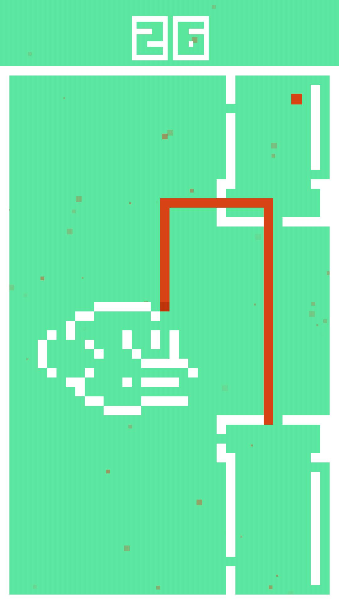
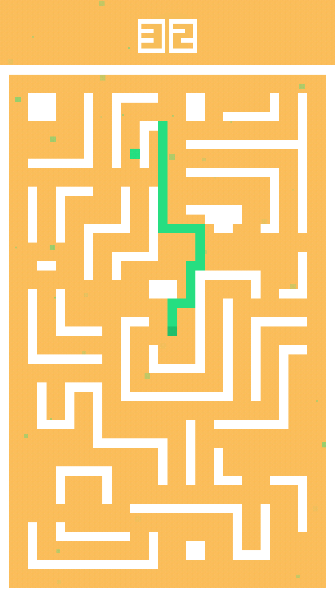
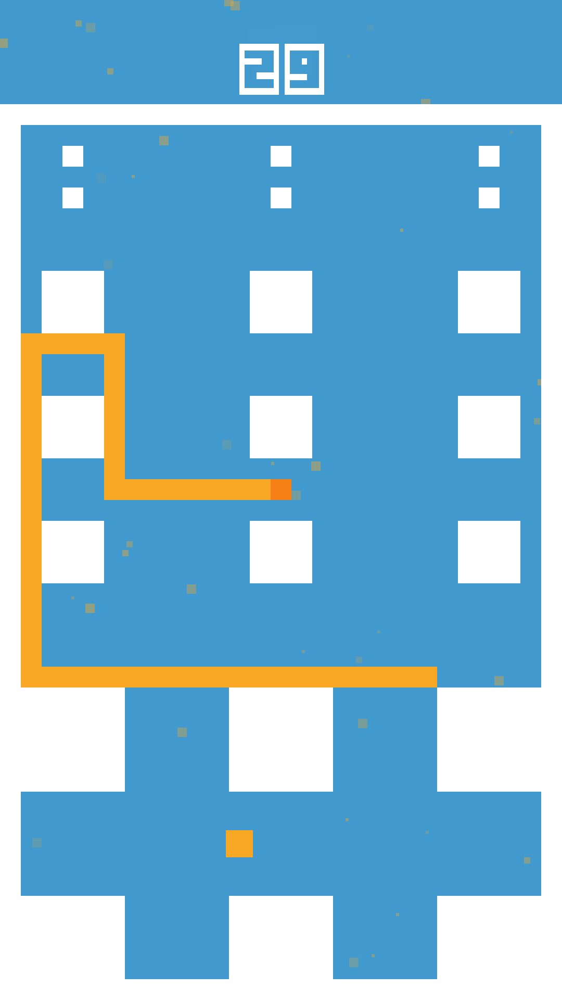
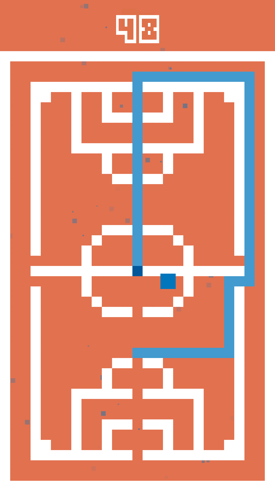

# Sn4ke
Snake game made with libGDX with 60 levels.  
This game is open source, with no ads and no tracking.

If you like the game, consider supporting me on Ko-fi :-)  
Every donation means a lot to me and helps me to cover the Apple Developer fees.

**Table of contents**
- [Sn4ke](#sn4ke)
  - [Screenshots](#screenshots)
- [Getting started](#getting-started)
- [Contributions](#contributions)
- [Licenses](#licenses)
  - [Third party assets](#third-party-assets)

## Screenshots

  
  
  
  

# Getting started

Take a look at the official libGDX [documentation](https://libgdx.com/dev/) on how to get started with libGDX and how to setup the project.  
Or just contact me at simon.dalvai@posteo.de, I'll help you to get started and update this README, so that others can also contribute. But until that doesn't happen, I'm too lazy to write a setup documentation.

# Contributions
If you want to contribute to the project, please fork the repo,    
make your changes and make a pull request with a short description  
of the changes you made.

# Licenses
The game itself is licensed under the [GNU AGPL v3.0](LICENSE) license and all  
assets made by myself and not mentioned in the [Third party assets](#third-party-assets) section, are licensed under the [CC-BY-SA-4.0](https://creativecommons.org/licenses/by-sa/4.0/) license.

## Third party assets

The following assets are kindly made by [kenney.nl](https://www.kenney.nl/assets/digital-audio) under the [CC-0-1.0](https://creativecommons.org/publicdomain/zero/1.0/) license.

`android/assets/sound/`

The font is made by Brandon S. aka Tepid Monkey.  
You can find the font and the license on [1001fonts.com](https://www.1001fonts.com/origami-mommy-font.html)

`android/assets/skin/origa___.fnt`
